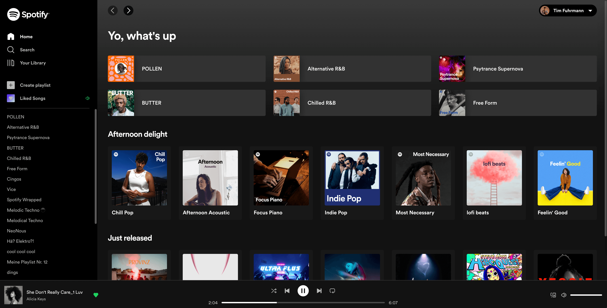
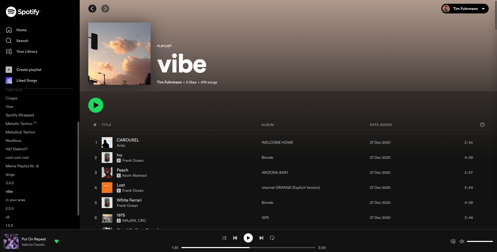

WORK IN PROGRESS

This demo has been developed before Spotify Web's "relaunch".

Check it out: https://demo-spotify-web.vercel.app/ - since this isn't a public application, you need a Spotify developer account to be able to access this demo.

This is not a 1:1 clone. Due to api restrictions and time reasons, some features haven’t been implemented at all, differently or not thoroughly.





## Known issues
- **Spotify Connect**: Since there is no access to a websocket whatsoever, the application uses invalidating and refetching queries in the right moments to update the active track - this is far from perfect, which is why I force playing on this device when connect is active. **For the best experience don't use Spotify Connect.**
- **Active Track**: Sometimes a track is not being highlighted even though it is playing. The web sdk occasionally plays a different version of the song that was requested which results in a mismatch of the track's uri.
- **Mobile Support**: The web sdk's mobile support isn't great yet, which is why this demo is not optimized for mobile usage.
- **Repeat track**





## Getting Started

Run the development server:

```bash
npm run dev
# or
yarn dev
```

Open [http://localhost:3000](http://localhost:3000) with your browser to see the result.

The `pages/api` directory is mapped to `/api/*`. Files in this directory are treated as [API routes](https://nextjs.org/docs/api-routes/introduction) instead of React pages.
